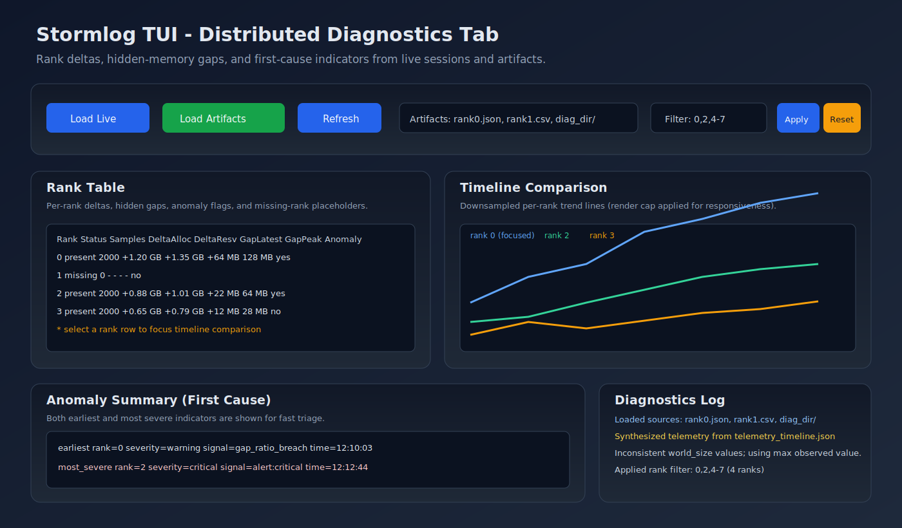
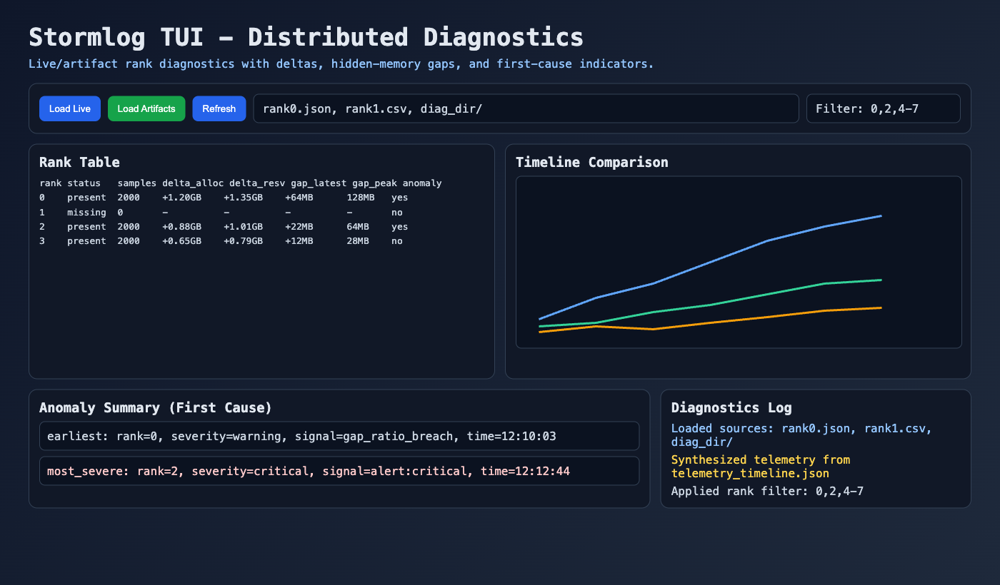

# Terminal UI (Textual) Guide

The Stormlog now ships with a Textual-based TUI that bundles key
workflows—system discovery, PyTorch/TensorFlow checklists, and CLI helpers—into
an interactive terminal experience.

## Installation

Install the optional TUI dependencies:

```bash
pip install "stormlog[tui]"
```

During development you can also rely on `requirements-dev.txt`, which already
includes `textual`.

## Launching the TUI

```bash
stormlog
```

### What You’ll See

- **Overview tab** – Live system summary (platform, Python/TensorFlow versions,
  GPU snapshot). Use `r` to refresh.
- **PyTorch tab** – Copy-ready commands for curated demos, a live GPU memory
  table, and a refreshable profile summary (fed by
  `gpumemprof.context_profiler`) that highlights recent decorator/context runs.
- **TensorFlow tab** – Equivalent guidance with an auto-updating table, plus a
  profile summary sourced from `tfmemprof.context_profiler` so you can review
  calls without leaving the terminal.
- **Monitoring tab** – Start/stop an actual tracker session (GPU when CUDA is
  available, otherwise the CPU tracker), stream live allocation/alert events into
  a dedicated log, review rolling stats (current, peak, utilization, alert
  counts), tweak warning/critical thresholds, toggle `MemoryWatchdog`, and
  export the full event history to CSV/JSON with one click.
- **Visualizations tab** – Refresh an ASCII timeline for quick inspection, then
  export the same data as a Matplotlib PNG or Plotly HTML file (saved under
  `./visualizations`) for richer analysis.
- **Diagnostics tab** – Load distributed telemetry from live sessions or merged
  artifacts, compare per-rank deltas/gaps, inspect first-cause indicators
  (earliest + most severe), and focus timeline comparisons by rank.
- **CLI & Actions tab** – Rich instructions plus quick-run buttons that execute
  `gpumemprof` / `tfmemprof` commands directly inside the TUI. Dedicated launch
  helpers include buttons for `gpumemprof diagnose`, the OOM scenario runner,
  and the capability-matrix smoke command. A command input box (with Run/Cancel
  controls) lets you stream any shell command into the inline log. When CUDA
  isn’t present, those commands automatically switch to CPU/MPS-compatible paths
  so you can still prototype workflows locally.

When you click **Start Live Tracking** in the Monitoring tab, the TUI spins up
`gpumemprof.tracker.MemoryTracker` in the background, pipes every event into the
log, and keeps the stats table in sync every second. Toggle **Auto Cleanup** to
let `MemoryWatchdog` react to warnings/criticals, or use the force/aggressive
cleanup buttons to trigger a manual `torch.cuda.empty_cache()` + GC sweep.

The Visualizations tab reads from the same tracking session: hit **Refresh
Timeline** once events start flowing to render an ASCII graph plus summary
stats, then use **Generate PNG Plot** (Matplotlib) or **Generate HTML Plot**
(Plotly) to save richer artifacts you can share. Install the `[viz]` extra
(`pip install "stormlog[viz]"`) if you want the optional Plotly
export.

The Diagnostics tab consumes either live telemetry (from the active
`TrackerSession`) or merged artifacts (`JSON`, `CSV`, and diagnose directories).
Use **Load Live** / **Load Artifacts**, then **Refresh** to rebuild the model.
The rank table surfaces per-rank deltas and hidden-gap metrics, while the
anomaly summary highlights both first-cause views: earliest anomaly and most
severe anomaly. Rank filter expressions support `all`, comma-separated ranks,
and inclusive ranges such as `0,2,4-7`.
The current tested responsiveness bound is **64 ranks × 2,000 samples/rank**
via synthetic diagnostics model coverage in `tests/tui/test_distributed_diagnostics.py`.

The PyTorch/TensorFlow tabs both include **Refresh Profiles** and **Clear
Profiles** buttons. They query the global profiler instances used by the
`profile_function` decorators / `profile_context` managers, so any workloads you
wrap with those helpers automatically appear in the tables with peak memory,
delta-per-call, and average duration metrics.

Need raw tracker data? While monitoring is active, hit **Export CSV** or
**Export JSON** in the same tab to dump every recorded event into `./exports/`
for later analysis.

Want to automate CLI workflows? Use the command input at the bottom of the CLI
tab (or the quick buttons) to launch `gpumemprof`/`tfmemprof` commands without
leaving the dashboard—the RichLog streams stdout/stderr live, and **Cancel
Command** terminates long-running jobs.

For release QA, use these CLI tab quick actions:

- **gpumemprof diagnose**: writes a fresh diagnostic artifact bundle.
- **OOM Scenario**: runs the safe simulated OOM flight-recorder workflow.
- **Capability Matrix**: launches the smoke matrix with `--skip-tui` so it can
  run from inside the dashboard without nesting PTY sessions.

Watching for leaks? The monitoring tab now includes a live alert history plus
sliders for warning/critical thresholds (GPU mode) so you can tune signal/noise
without restarting the tracker.

## Distributed Diagnostics Screenshots

Deterministic workflow snapshot (SVG):



Manual render (PNG):



Keyboard shortcuts:

| Key | Action                   |
| --- | ------------------------ |
| `r` | Refresh overview         |
| `f` | Focus the log panel      |
| `g` | Log `gpumemprof info`    |
| `t` | Log `tfmemprof info`     |
| `q` | Quit the TUI             |

## Prompt Toolkit Roadmap

For command-palette or multi-step form experiences, we plan to layer in
`prompt_toolkit` components (e.g., an interactive shell for running
`gpumemprof`/`tfmemprof` commands with auto-completion). The Textual layout is
designed to accommodate this future addition without breaking compatibility.

## Troubleshooting

- **Missing dependency** – Ensure you used `pip install "stormlog[tui]"`.
- **GPU-less environments** – The overview tab will fall back to CPU-only data
  and explicitly state when GPU metrics are unavailable.
- **Terminal too small** – Textual adapts to smaller windows, but a minimum of
  ~100x30 characters makes the tabs most readable.

For more sample commands, see the Markdown test guides under
`docs/examples/test_guides/README.md`.
