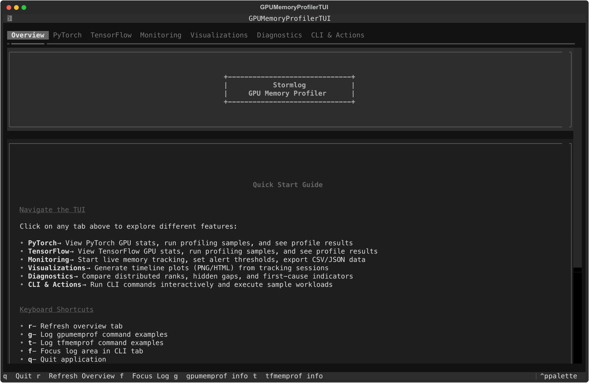
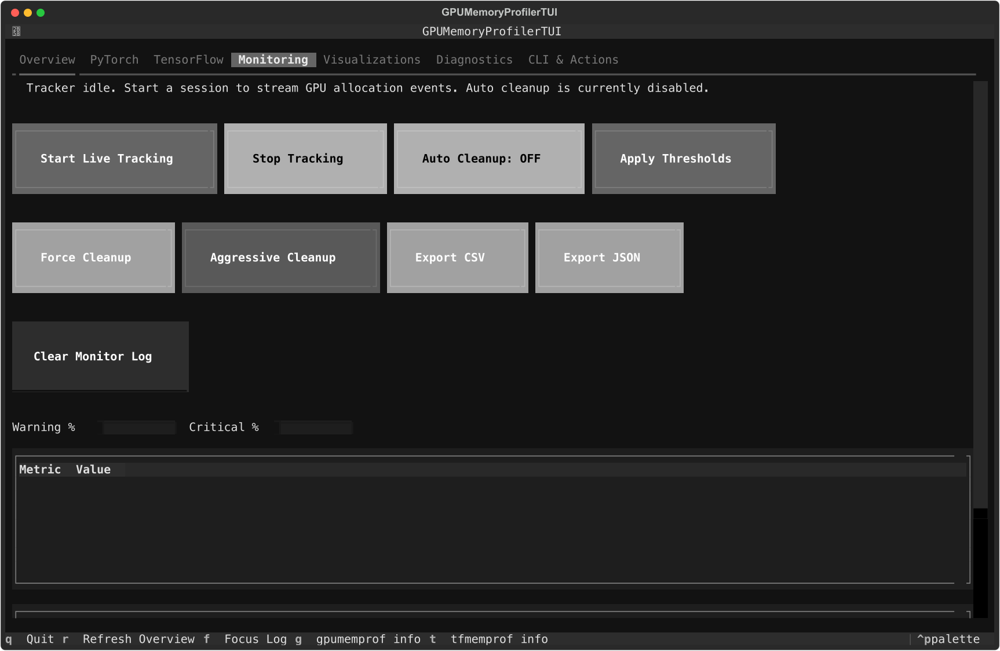
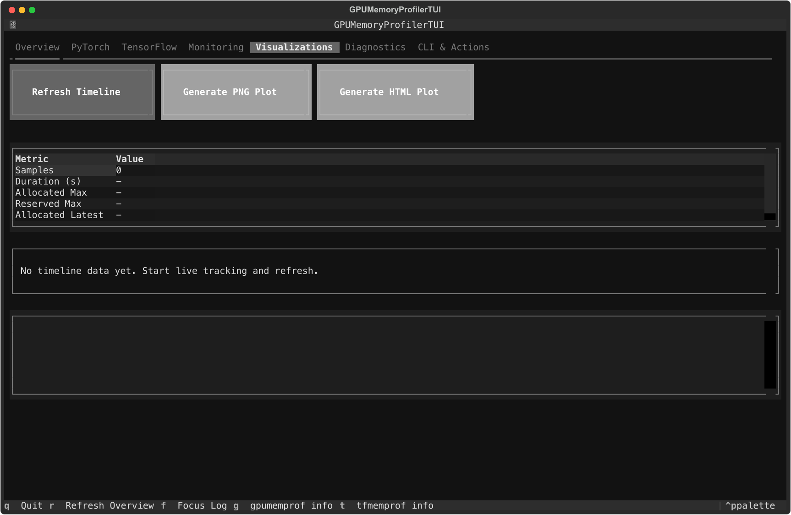
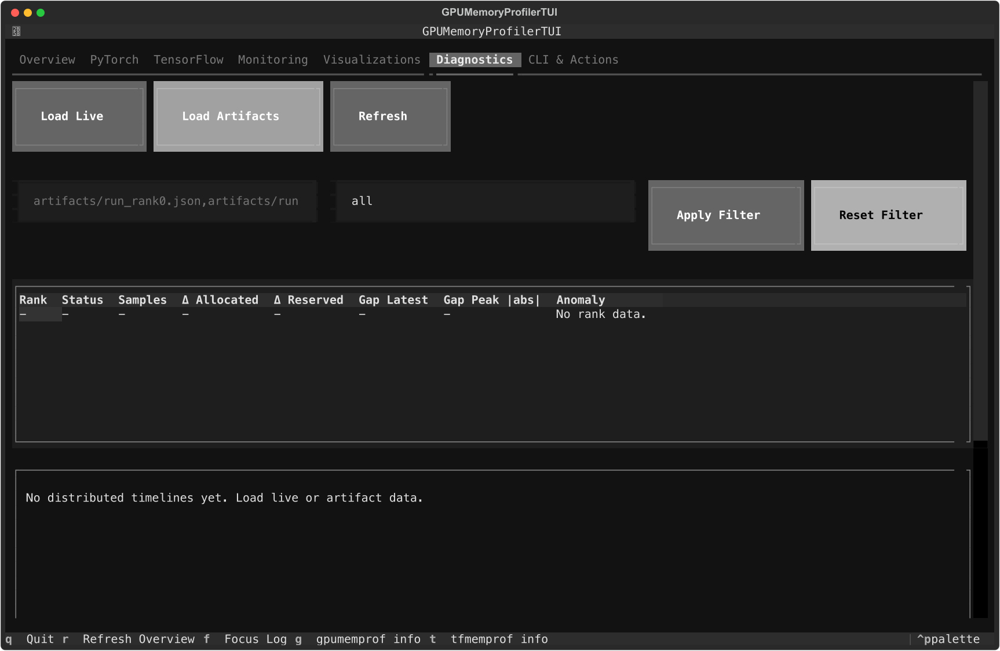
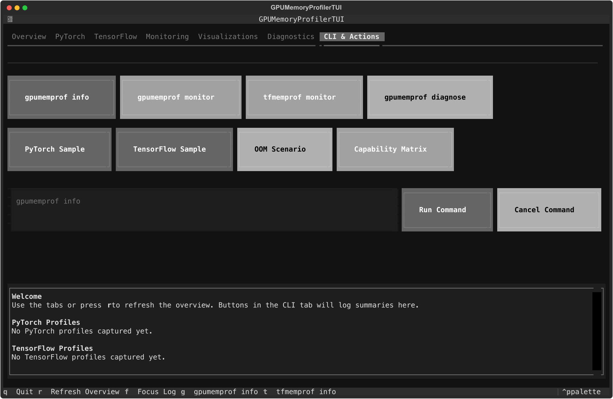
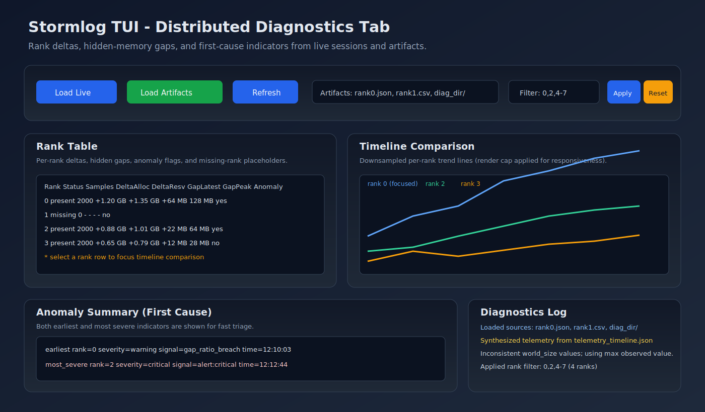
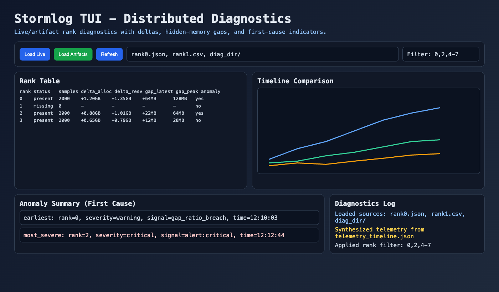

# Terminal UI Guide

Stormlog ships a Textual TUI for teams that want to move between live monitoring, exported artifacts, and command execution without leaving the terminal.

## Install and launch

```bash
pip install "stormlog[tui,torch]"
stormlog
```

If you are working from a source checkout, reinstall with the TUI dependencies so the current app startup requirements are present:

```bash
pip install -e ".[tui,torch]"
```

## Current tabs

The current TUI surface contains seven tabs:

- `Overview`
- `PyTorch`
- `TensorFlow`
- `Monitoring`
- `Visualizations`
- `Diagnostics`
- `CLI & Actions`

## What each tab is for

### Overview

- shows current platform and runtime information
- links you to the recommended sample commands
- is the fastest place to confirm that the app launched with the expected environment



### PyTorch

- shows current PyTorch stats
- runs a sample PyTorch workload
- refreshes or clears collected profile summaries

If CUDA is unavailable, the sample workload falls back to the CPU profiler path when possible.

### TensorFlow

- shows TensorFlow environment details
- runs a sample TensorFlow workload
- refreshes or clears collected TensorFlow profile summaries

### Monitoring

- starts or stops a live tracker session
- shows rolling memory stats
- exports current tracker events to `./exports`
- lets you tune warning and critical thresholds when using the GPU tracker
- exposes watchdog controls for supported GPU environments



Use this tab when you want the data that later feeds the Visualizations or Diagnostics tabs.

### Visualizations

- renders an ASCII timeline from the active tracker session
- writes PNG plots to `./visualizations`
- writes HTML plots to `./visualizations`



The export buttons only work after timeline samples exist. If you have not started tracking yet, the tab will report that no timeline data is available.

### Diagnostics

- loads live telemetry from the active tracker session
- loads artifacts from JSON, CSV, or diagnose directories
- rebuilds rank-level diagnostics
- supports rank filters such as `all`, `0,2,4-7`
- highlights anomaly indicators and focused rank timelines



The artifact input field accepts comma-separated paths. Use `Load Artifacts` first, then `Refresh` after changing the path set.

### CLI & Actions

- runs common `gpumemprof` and `tfmemprof` commands
- runs sample workloads
- runs the OOM scenario helper
- runs the capability matrix smoke path
- lets you enter any shell command into the inline runner



Use this tab when you want to kick off a CLI flow and keep the output attached to the same TUI session.

## Daily workflows

### Workflow: capture and export a live session

1. Open `Monitoring`.
2. Click `Start Live Tracking`.
3. Let the workload run long enough to collect samples.
4. Use `Export CSV` or `Export JSON` if you want the raw event stream.
5. Move to `Visualizations` and click `Refresh Timeline`.
6. Export PNG or HTML if you want a shareable plot.

### Workflow: investigate a saved artifact

1. Open `Diagnostics`.
2. Enter one or more artifact paths.
3. Click `Load Artifacts`.
4. Click `Refresh`.
5. Narrow the result set with the rank filter if needed.
6. Select a rank from the table to focus the timeline.

### Workflow: run the release smoke path from the UI

1. Open `CLI & Actions`.
2. Click `Capability Matrix`.
3. Review the inline log output.
4. If you need more detail, rerun the same command in a normal shell and archive the artifacts.

## Distributed diagnostics reference image

Deterministic workflow render:



PNG copy for environments that prefer raster images:



## Keyboard shortcuts

| Key | Action |
| --- | --- |
| `r` | Refresh overview |
| `f` | Focus the CLI log |
| `g` | Log `gpumemprof info` hints |
| `t` | Log `tfmemprof info` hints |
| `q` | Quit the TUI |

## Troubleshooting

### `stormlog` is missing

Install the TUI extra:

```bash
pip install "stormlog[tui,torch]"
```

### PNG or HTML export fails

- install `stormlog[viz]`
- make sure you already have live timeline samples

### Diagnostics shows no data

- load live telemetry after starting a tracker session, or
- load actual JSON, CSV, or diagnose artifact paths before refreshing

### The app launched but the window looks empty

Increase the terminal size. The deterministic tests use roughly `140x44`, and smaller sizes will compress the layout significantly.
